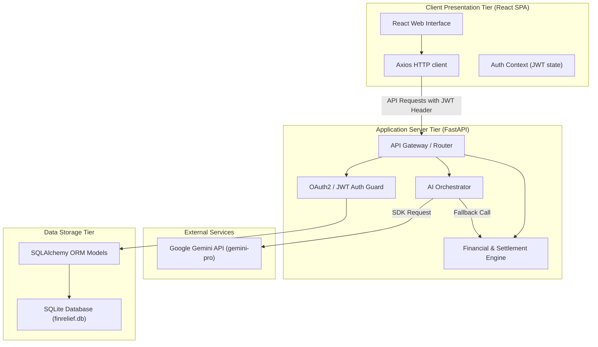
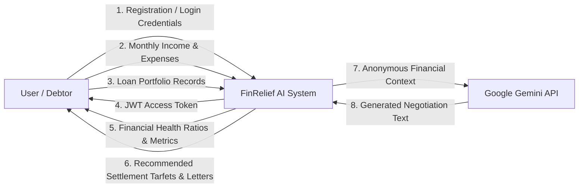
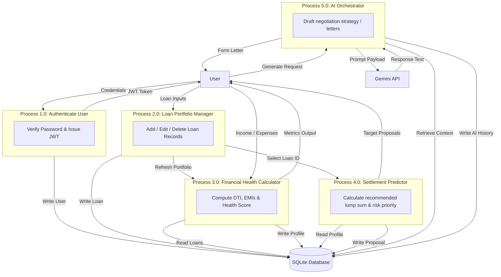
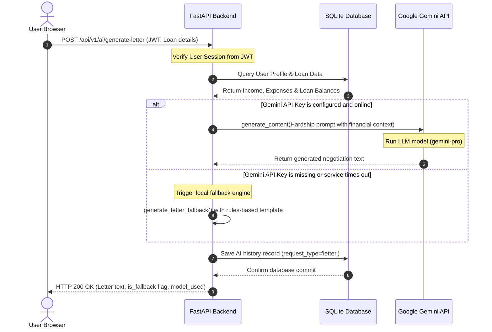
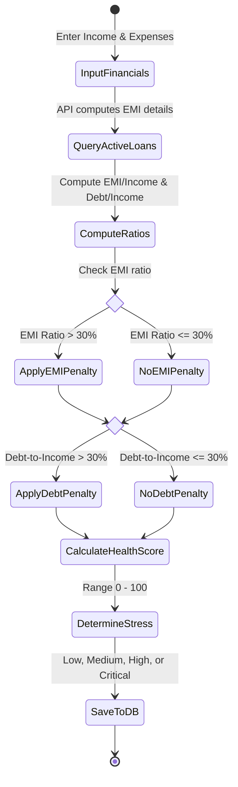
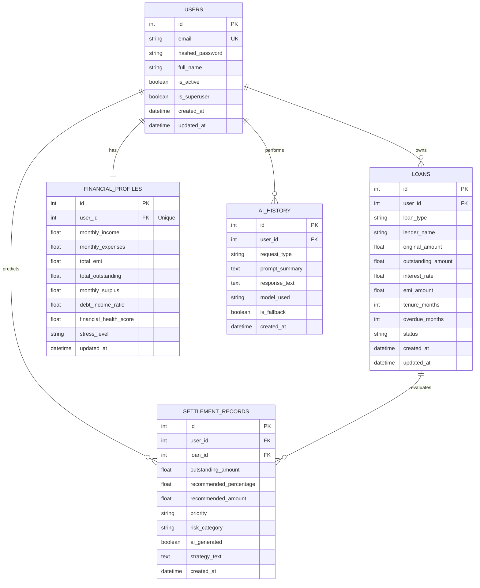

# Chapter 5 — System Design

This chapter describes the structural and behavioral design of the **FinRelief AI** platform. It details the system architecture, flowcharts, data flows, use cases, database tables, and API interfaces.

---

## 5.1 System Architecture

FinRelief AI is built on a decoupled, three-tier architecture:
1. **Presentation Layer (Frontend)**: A React.js single-page application (SPA) styled with vanilla CSS variables and compiled using Vite. It handles client-side routing, user forms, and state management.
2. **Application Layer (Backend API)**: A FastAPI Python web application serving as the gateway. It implements token-based authentication guards, validates schemas using Pydantic, and executes calculation algorithms.
3. **Data Layer (Storage)**: A relational SQLite database managed via SQLAlchemy Object Relational Mapper (ORM).

### Architecture Diagram


---

## 5.2 Data Flow Diagrams (DFD)

### DFD Level 0 (Context Diagram)


### DFD Level 1 (Process Detail Diagram)


---

## 5.3 Use Case Diagram & Descriptions

### Use Case Diagram
```mermaid
leftToRightDirection
actor User as "Debtor User"
actor Gemini as "Gemini API Server"

rectangle "FinRelief AI Platform" {
    usecase UC1["Register & Login Account"]
    usecase UC2["Manage Loan Records (CRUD)"]
    usecase UC3["Calculate Financial Profile"]
    usecase UC4["Predict Settlement Offer Targets"]
    usecase UC5["Generate Hardship Negotiation Letters"]
    usecase UC6["Consult AI Financial Chat Counselor"]
    usecase UC7["View AI & Settlement History Logs"]
}

User --> UC1
User --> UC2
User --> UC3
User --> UC4
User --> UC5
User --> UC6
User --> UC7

UC5 -.->|Calls| Gemini
UC6 -.->|Calls| Gemini
```

### Use Case Descriptions

#### 1. Use Case Name: Register & Login Account
* **Actor**: Debtor User.
* **Pre-conditions**: Browser connected to platform URL.
* **Post-conditions**: User receives JWT stored in localStorage; session initiated.
* **Basic Flow**:
  1. User fills out username, email, and password on Register screen.
  2. Frontend sends JSON payload to `POST /api/v1/auth/register`.
  3. Database verifies email uniqueness and hashes password.
  4. User logins at `/login` and receives JWT access token.

#### 2. Use Case Name: Manage Loan Records (CRUD)
* **Actor**: Debtor User.
* **Pre-conditions**: Authenticated session.
* **Post-conditions**: Loan data added/modified in SQLite DB.
* **Basic Flow**:
  1. User navigates to Loan Portfolio screen.
  2. Clicks "Add Loan Record", enters balance, EMI, rate, overdue months, and clicks submit.
  3. API receives data, verifies ownership, saves record, and updates user profile statistics.

#### 3. Use Case Name: Predict Settlement Offer Targets
* **Actor**: Debtor User.
* **Pre-conditions**: Registered loans and monthly income/expenses configured.
* **Post-conditions**: Target settlement records generated and saved.
* **Basic Flow**:
  1. User opens Settlement Predictor, selects a loan, and clicks "Predict Target".
  2. API calculates base percentage adjustments according to interest and overdue months.
  3. Outputs lump-sum range, priority (Low/Medium/High/Critical), and risk category.

---

## 5.4 Sequence & Activity Diagrams

### Sequence Diagram: Hardship Letter Generation (With Fallback)


### Activity Diagram: User Financial Health Evaluation


---

## 5.5 Entity-Relationship (ER) & Database Design

### ER Diagram


---

## 5.6 API Architecture & Folder Structure

The API architecture leverages FastAPI's Dependency Injection (`Depends(get_db)`, `Depends(get_current_user)`) to isolate route definitions, database transactions, and security checks.

### High-level Code Layout
```
FinRelief-AI/
├── backend/                  # FastAPI Application Core
│   └── app/
│       ├── auth/             # Authentication & token verification helpers
│       ├── core/             # Logging and middleware config
│       ├── models/           # SQLAlchemy DB models mapping SQLite tables
│       ├── routers/          # API Controllers defining routes and endpoints
│       ├── schemas/          # Pydantic models for data parsing & validation
│       ├── services/         # Calculation services & Gemini API adapters
│       └── utils/            # Developer setup and test verification scripts
├── frontend/                 # React SPA Client Layout
│   └── src/
│       ├── components/       # Global UI components (Navbar, Sidebar)
│       ├── context/          # State providers (AuthContext)
│       ├── pages/            # View components (Dashboard, Settlement, AI History)
│       ├── services/         # Axios API clients
│       └── styles/           # Global styles and design variables (index.css)
```
*For a highly detailed breakdown of files and classes, refer to the [Developer Guide](file:///c:/Users/HP/OneDrive/Desktop/FinRelief-AI/Documentation/developer_guide.md).*
