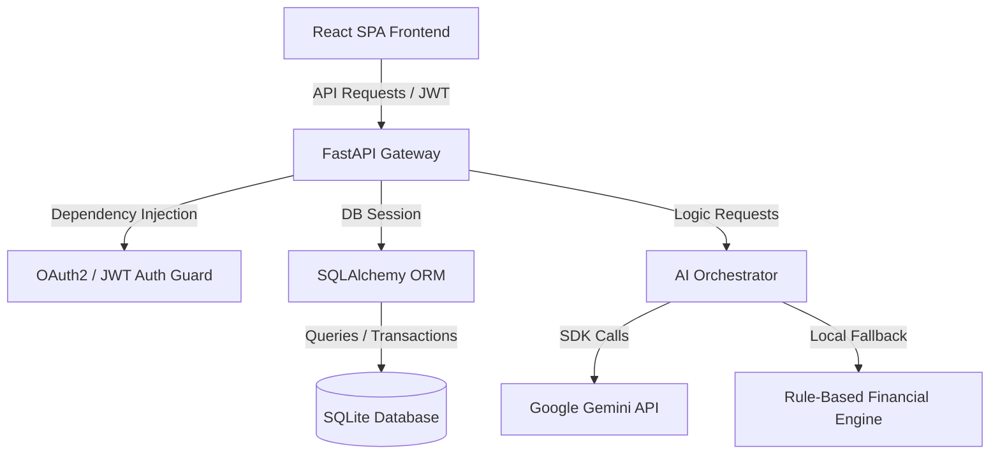

# FinRelief AI — AI-Powered Debt Relief & Financial Recovery Platform

FinRelief AI is a comprehensive full-stack application designed to help individuals analyze personal debt structures, optimize payment strategies, predict creditor settlement thresholds, and generate professional negotiation letters. It combines modern financial engineering principles with LLM-powered capabilities to empower users on their journey to financial recovery.

---

## 📌 Problem Statement
Many individuals struggling with outstanding debts face high stress, aggressive collections calls, and a complete lack of clarity on how to resolve their debts. Debt settlement can be complex, and hiring third-party settlement agencies is often expensive and risky. Users lack tools to:
1. Estimate achievable settlement percentages.
2. Draft formal hardship letters to creditors.
3. Track and evaluate their real debt-to-income and cash flow limits.

## 💡 Solution
FinRelief AI offers an autonomous, secure, and user-centric platform that puts debt resolution tools directly into the hands of the borrower. By analyzing current income, expenses, and loan structures, the platform:
- Computes detailed financial health profiles and debt-to-income ratios.
- Classifies creditor negotiation priorities and risk categories.
- Leverages Google Gemini AI to draft highly personalized settlement negotiation letters.
- Seamlessly falls back to an embedded, rule-based algorithmic financial engine when API keys are not configured.

---

## ✨ Features
- **Secure Authentication**: Built-in JWT-based authorization and session management.
- **Loan Portfolio CRUD**: Track multiple loans, outstanding balances, EMIs, interest rates, and overdue periods.
- **Financial Health Engine**: Automated calculations of cash flow surplus, EMI ratios, debt ratios, health scores, and stress levels.
- **Settlement Predictor**: Classifies lender risk, calculates recommended lump-sum settlement targets, and establishes timeline strategies.
- **AI Letter Generator**: Integrates Google Gemini API to write formal creditor hardship letters with a rule-based fallback model.
- **AI counselor Chat**: Interactive financial advisor chat directly in the user dashboard.
- **AI History Logs**: Ordered audit trail of all AI-generated strategies, letters, and counselor replies.

---

## 🛠️ Technology Stack

| Layer | Technologies |
|---|---|
| **Frontend** | React.js (v18), Vite, Vanilla CSS, Axios, Lucide Icons, React Router |
| **Backend** | Python (v3.11+), FastAPI, Uvicorn, Pydantic (v2) |
| **Database** | SQLite, SQLAlchemy ORM |
| **Security** | JWT (python-jose), bcrypt password hashing (passlib) |
| **AI Integration** | Google Gemini API (via google-generativeai SDK) |

---

## 🧠 System Architecture



---

## 📂 Project Structure

```
FinRelief-AI/
├── backend/
│   ├── app/
│   │   ├── auth/              # JWT token security & Depends(get_current_user)
│   │   ├── core/              # Logger setups
│   │   ├── models/            # SQLAlchemy Database schemas
│   │   ├── routers/           # Controllers (auth, loans, financial, settlement, ai, history)
│   │   ├── schemas/           # Pydantic validation models
│   │   ├── services/          # Business logic engines (financial, settlement, gemini, fallback)
│   │   ├── utils/             # E2E test verification scripts
│   │   ├── config.py          # Configuration and settings loader
│   │   ├── database.py        # SQLite engine & Session factory
│   │   └── main.py            # FastAPI entry point
│   ├── .env.example
│   └── requirements.txt
├── frontend/
│   ├── src/
│   │   ├── components/        # UI Sidebar & Navigation Layouts
│   │   ├── context/           # React AuthContext
│   │   ├── pages/             # Login, Dashboard, Loan CRUD, Settlement, AI History
│   │   ├── services/          # Axios backend clients
│   │   └── styles/            # CSS Design variables and theme definitions
│   ├── index.html
│   ├── package.json
│   └── vite.config.js
├── docs/                      # Technical specification documentation
├── screenshots/               # Application UI walk-through screenshots
├── .env.example               # Root configuration placeholders
├── requirements.txt           # Project dependencies at root
├── .gitignore                 # Configured to ignore local databases, build files, and secrets
├── LICENSE                    # MIT Open-Source License
└── README.md                  # Professional documentation file
```

---

## ⚙️ Installation & Setup

### Prerequisites
- **Python 3.11+**
- **Node.js 18+** and npm

---

### 🔑 Backend Setup

1. **Navigate to the backend directory**:
   ```bash
   cd backend
   ```

2. **Create and activate a virtual environment**:
   ```bash
   python -m venv venv
   # On Windows:
   .\venv\Scripts\activate
   # On macOS/Linux:
   source venv/bin/activate
   ```

3. **Install dependencies**:
   ```bash
   pip install -r requirements.txt
   ```

4. **Configure environment variables**:
   Create a `.env` file by copying the example template:
   ```bash
   cp .env.example .env
   ```
   Fill in your configuration details inside `.env`:
   ```env
   SECRET_KEY=your_secure_generated_key_here
   GEMINI_API_KEY=your_gemini_api_key_here  # Leave blank for local rule-based fallback
   ```

5. **Start the API server**:
   ```bash
   uvicorn app.main:app --reload
   ```
   The backend is served at: `http://127.0.0.1:8000`. You can inspect the interactive Swagger API documentation at `http://127.0.0.1:8000/docs`.

---

### 💻 Frontend Setup

1. **Navigate to the frontend directory**:
   ```bash
   cd ../frontend
   ```

2. **Install Node packages**:
   ```bash
   npm install
   ```

3. **Start the Vite development server**:
   ```bash
   npm run dev
   ```
   The frontend runs on `http://localhost:3000` with requests automatically proxied to the backend server.

---

## 🔌 API Overview

### Authentication
- `POST /api/v1/auth/register` - Create a new user profile.
- `POST /api/v1/auth/login/json` - Login with credentials to receive JWT token.
- `GET /api/v1/auth/me` - Retrieve current user session.

### Loan Management
- `GET /api/v1/loans` - List all registered user loans.
- `POST /api/v1/loans` - Add a new loan record.
- `PUT /api/v1/loans/{id}` - Modify details of a specific loan.
- `DELETE /api/v1/loans/{id}` - Remove a loan record.

### Financial Health
- `GET /api/v1/financial/health` - Retrieve user DTI metrics, stress level, and cash flow.
- `POST /api/v1/financial/calculate` - Enter monthly income and expenses to update profile.

### Settlement Engine & AI Helpers
- `POST /api/v1/settlement/predict` - Predict recommended lump-sum settlement targets.
- `POST /api/v1/ai/generate-strategy` - Get custom debt negotiation recommendations.
- `POST /api/v1/ai/generate-letter` - Write formal hardship letters.
- `GET /api/v1/history/ai` - Fetch user's history of AI interactions.

---

## 🗺️ Entity Relationship (ER) Diagram
```
  [User]
    | (1)
    |
    |----(N)----> [Loan]
    |               | (1)
    |               |
    |               +----(1)----> [SettlementRecord]
    |
    |----(1)----> [FinancialProfile]
    |
    +----(N)----> [AIHistory]
```

---

## 🖼️ Screenshots Section
*(Screenshots of user dashboard, loan CRUD tables, settlement predictions, and AI counseling history can be added in the [screenshots/](screenshots/) folder)*

---

## 🔮 Future Enhancements
- **Multi-Format Document Export**: Supporting PDF/Docx downloads for formal negotiation letters.
- **Credit Score Simulator**: Simulating credit rating recovery curves post-settlement.
- **Automatic Reminder Alerts**: Calendar integrations for creditor negotiation and payment milestones.

---

## 📄 License
This project is licensed under the [MIT License](LICENSE).

---

## 🎥 Demo Video

Watch the project demo on YouTube:

https://youtu.be/TxeQBBpjjJU?si=8hd4glvBKnPpKZua
